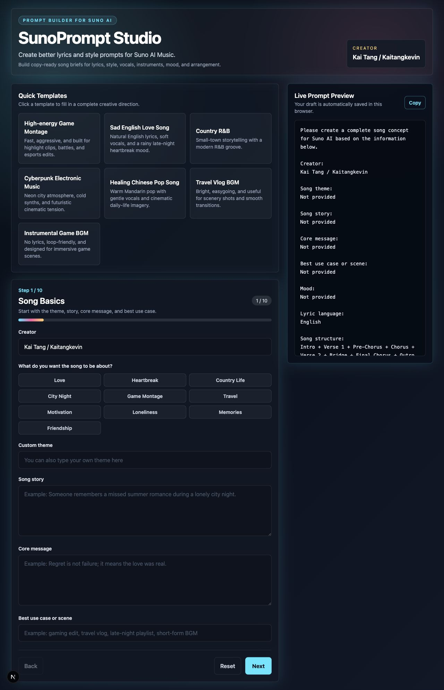
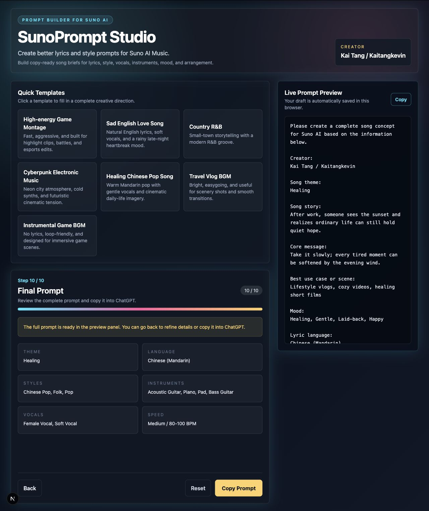

# SunoPrompt Studio

SunoPrompt Studio is a step-by-step prompt builder for Suno AI music creators. It turns raw song ideas into structured, copy-ready prompts that can be sent to ChatGPT to generate lyrics, a Suno style prompt, song structure notes, vocal direction, instrumentation, mood, and arrangement guidance.

## Website

Visit the live site: [https://kaitangkevin.github.io/sunoprompt-studio/](https://kaitangkevin.github.io/sunoprompt-studio/)

## Screenshots





## Creator

Created by **Kai Tang**, also known as **Kaitangkevin**.

I build practical AI tools that help creators move faster from an idea to a usable result. SunoPrompt Studio was designed for music makers, short-form video creators, and AI music experimenters who want stronger prompts without needing to learn complex prompt-writing patterns first.

My focus for this project is simple: make the creative setup process feel clear, guided, and fast. Instead of asking users to write a perfect music prompt from scratch, the app breaks the task into approachable decisions about story, mood, language, genre, instruments, vocals, tempo, and required phrases.

## What It Does

SunoPrompt Studio does not generate music directly. It helps users prepare a complete creative brief that can be pasted into ChatGPT. The generated prompt asks ChatGPT to produce:

- Full lyrics
- A Suno-ready Style Prompt
- Song structure notes
- Vocal performance notes
- Instrumentation and arrangement notes
- Copy-ready sections for Suno

The goal is to help non-technical creators create more precise music prompts with less friction.

## Key Features

- Guided 10-step prompt builder
- Live prompt preview
- Copy Prompt button with fallback clipboard support
- Browser local storage for draft persistence
- Quick templates for common music use cases
- Multi-select mood, style, instrument, and vocal options
- Custom creator field
- Custom language, structure, accent, and BPM support
- Responsive dark UI
- GitHub Pages deployment workflow

## Prompt Builder Flow

1. Song basics
2. Lyric mood
3. Lyric language
4. Song structure
5. Required words or phrases
6. Music style
7. Instruments
8. Vocal direction
9. Tempo and speed
10. Final copy-ready prompt

## Quick Templates

The app includes ready-made starting points for:

- High-energy game montage song
- Sad English love song
- Country R&B
- Cyberpunk electronic music
- Healing Chinese pop song
- Travel vlog BGM
- Instrumental game BGM

Each template fills in the creative direction automatically and sends the user to the final prompt preview.

## Tech Stack

- Next.js
- React
- TypeScript
- Tailwind CSS
- Local state with `useState`
- Browser `localStorage`
- GitHub Pages for static deployment

## Local Development

Install dependencies:

```bash
npm install
```

Run the development server:

```bash
npm run dev
```

Build for production:

```bash
npm run build
```

Build with the GitHub Pages base path:

```bash
GITHUB_PAGES=true npm run build
```

## Deployment

The repository includes a GitHub Actions workflow at `.github/workflows/deploy.yml`.

On every push to `main`, the workflow:

1. Installs dependencies with `npm ci`
2. Builds the static Next.js site
3. Uploads the `out` directory as a GitHub Pages artifact
4. Deploys the site to GitHub Pages

## Future Roadmap

- Connect the OpenAI API to generate lyrics and style prompts directly
- Add a Suno Style character counter
- Add lyric length controls
- Add bilingual lyric translation
- Add prompt history and favorites
- Add TXT export
- Add user login and cloud sync
- Add viral short-video music templates
- Add more creator profile customization
